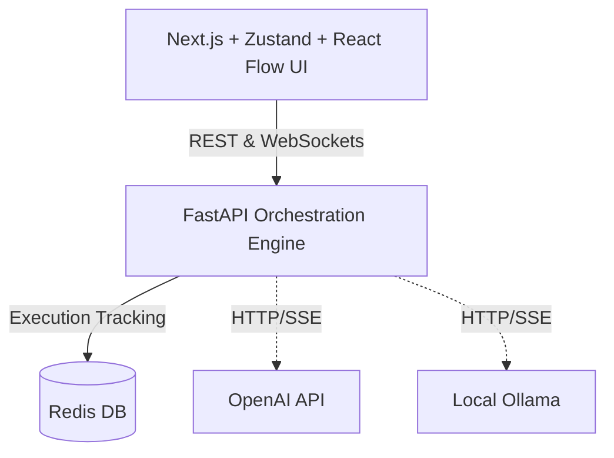

# Multi-LLM Workflow Orchestrator 🌊

A high-performance, asynchronous orchestration platform that allows users to construct complex, Directed Acyclic Graph (DAG) logic flows bridging multiple AI providers (OpenAI, Ollama) effortlessly.


## 🏗 System Architecture

The core topology utilizes a separated boundary pattern, hooking an extremely lightweight Next.js React Flow front end into a parallelized FastAPI engine. 



* **Frontend**: Next.js 14, Zustand, TailwindCSS, `@xyflow/react`.
* **Backend**: FastAPI, `asyncio`, Pydantic strict schemas.
* **Database**: Redis Hash/Timeline persistence arrays.

## 🚀 Quickstart (Docker Compose)

The entire application runs seamlessly natively within Docker.

```bash
# 1. Clone the repository
git clone https://github.com/Mrkod-ER/multi-llm-workflow.git
cd multi-llm-workflow

# 2. Add your environment keys
cp .env.example .env
# Edit .env with your OPENAI_API_KEY if desired.

# 3. Boot the environment
docker-compose up --build -d
```

> **Note**: Locally hosted Ollama binds securely via `http://host.docker.internal:11434` resolving bridge restrictions automatically out-of-the-box!

Wait a few seconds for Uvicorn and Next to compile, then navigate to:
**http://localhost:3000**

## 💡 Real-time Streaming
Every node execution broadcasts live sub-word chunks across our `ws://localhost:8000/api/v1/workflows/ws/run` connection. Typewriting latency is minimized via decoupled async queues scaling non-blocking across large node-sets.

## 📜 History Persistence
Navigate to the top-right "History" drawer to review, inspect, and branch past workflows cached immutably in memory.

---
*Created with ❤️ by the Mrkod-ER team as a rapid, dynamic orchestration suite for exploring parallel LLM topologies!*
